# 004 — Auth Implementation Reference

> How authentication actually works in the codebase. For design rationale, see `003-Auth.md`.

---

## Table of Contents

1. [Sign-In / Sign-Up (Email OTP)](#1-sign-in--sign-up-email-otp)
2. [Magic Link Flow](#2-magic-link-flow)
3. [Invitation Flow](#3-invitation-flow)
4. [Room Resolution](#4-room-resolution)
5. [Session Management](#5-session-management)
6. [API Key Authentication (Agents)](#6-api-key-authentication-agents)
7. [Rate Limiting & Abuse Prevention](#7-rate-limiting--abuse-prevention)
8. [Terms Re-acceptance](#8-terms-re-acceptance)
9. [Security Audit & Known Issues](#9-security-audit--known-issues)
10. [Environment Variables](#10-environment-variables)
11. [File Reference](#11-file-reference)

---

## 1. Sign-In / Sign-Up (Email OTP)

Sign-up is not a separate flow. First-time users create accounts automatically on first successful OTP verification (`disableSignUp: false`).

### Full OTP Flow

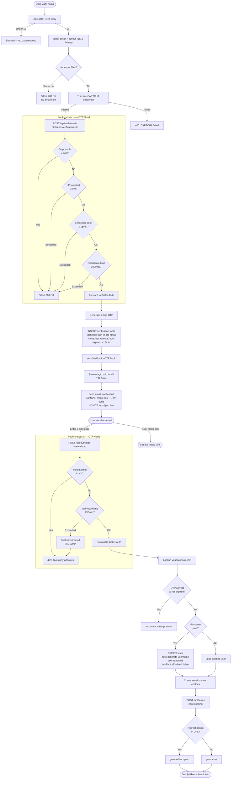

### Step Details

**Age gate** (`login/+page.svelte`): Date of birth entry, minimum age 16. Stored in `localStorage` only — DOB is never sent to the server.

**Email + terms** (`login/+page.svelte`): Two separate checkboxes (ToS, Privacy Policy). Honeypot hidden field traps bots (if filled, silently "succeeds"). Invitation pre-fills and locks email via `?email=` URL param.

**Turnstile** (`hooks.server.ts:204-243`): Cloudflare Turnstile widget rendered in dark theme. Token passed as `x-captcha-response` header. Verified server-side against `challenges.cloudflare.com/turnstile/v0/siteverify`. Only enforced on OTP send, not verify.

**OTP storage**: Better Auth inserts into `verification` table:
- `identifier`: `sign-in-otp-{email}`
- `value`: `{otp}:{attemptCount}` (e.g., `"920902:0"`)
- `expiresAt`: now + 15 minutes

**Email delivery** (`lib/server/email.ts`): OTP email includes both a magic link (opaque token) and the 6-digit code. OTP is NOT in the subject line (prevents lock-screen exposure).

**New user creation** (`lib/server/auth/index.ts`): Database hook auto-generates username `user-{8-char-uuid}` if not set. The `twoFactorEnabled` column defaults to `false` (required by twoFactor plugin).

**Resend code** (`login/+page.svelte`): Button on code entry step calls `sendVerificationOtp` again. No Turnstile on resend (token is single-use, already consumed on first send).

---

## 2. Magic Link Flow

Two-step process to prevent email client prefetching from consuming the OTP.

### KV Storage

```
Key:   magic:{uuid}
Value: { "email": "user@example.com", "otp": "123456" }
TTL:   5 minutes
```

### Sequence

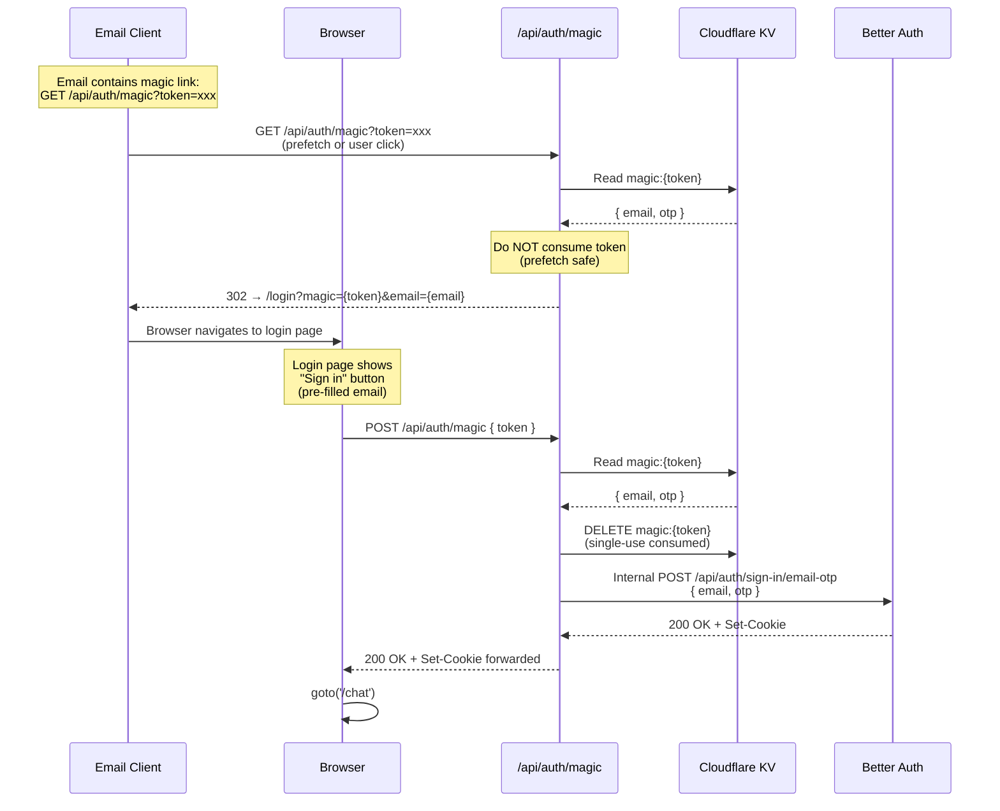

**Why two steps**: Email clients (Gmail, Outlook) prefetch links via GET. If GET consumed the token, the link would be dead by the time the user clicks it.

**Errors**: `410 Gone` (token expired/used), `400` (missing token), `401` (OTP verification failed).

Source: `src/routes/api/auth/magic/+server.ts`

---

## 3. Invitation Flow

### Sending an Invitation

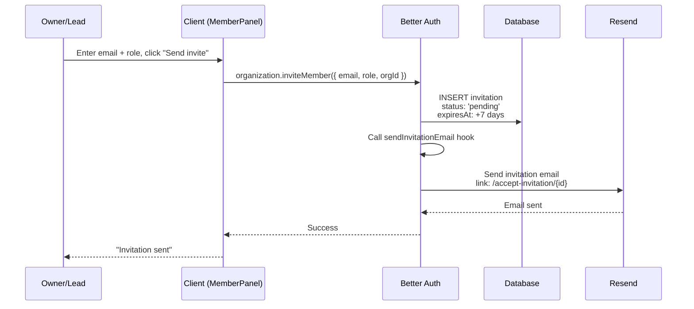

### Accepting an Invitation — All Scenarios

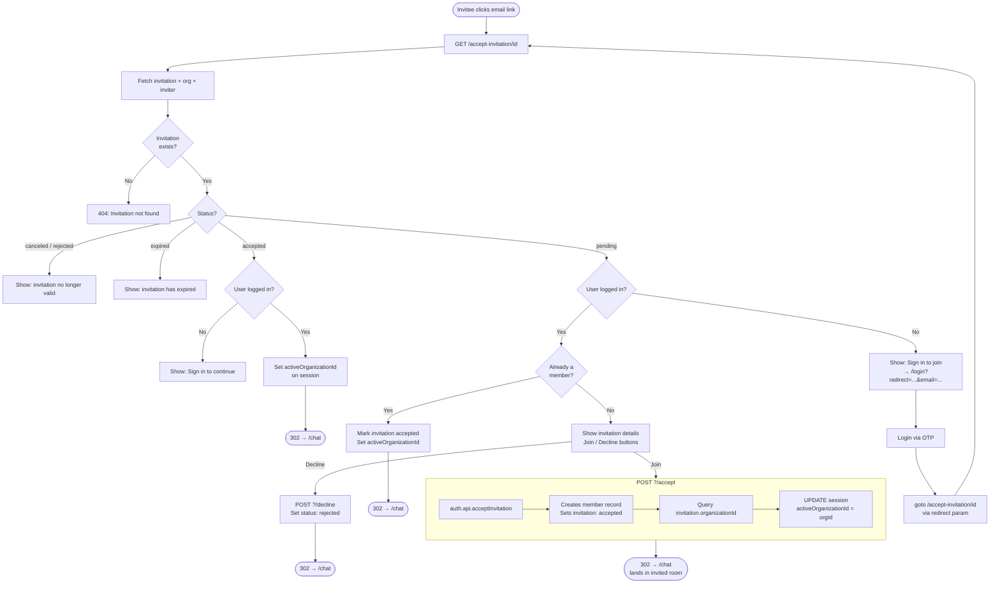

### Invitation for New User (end-to-end)

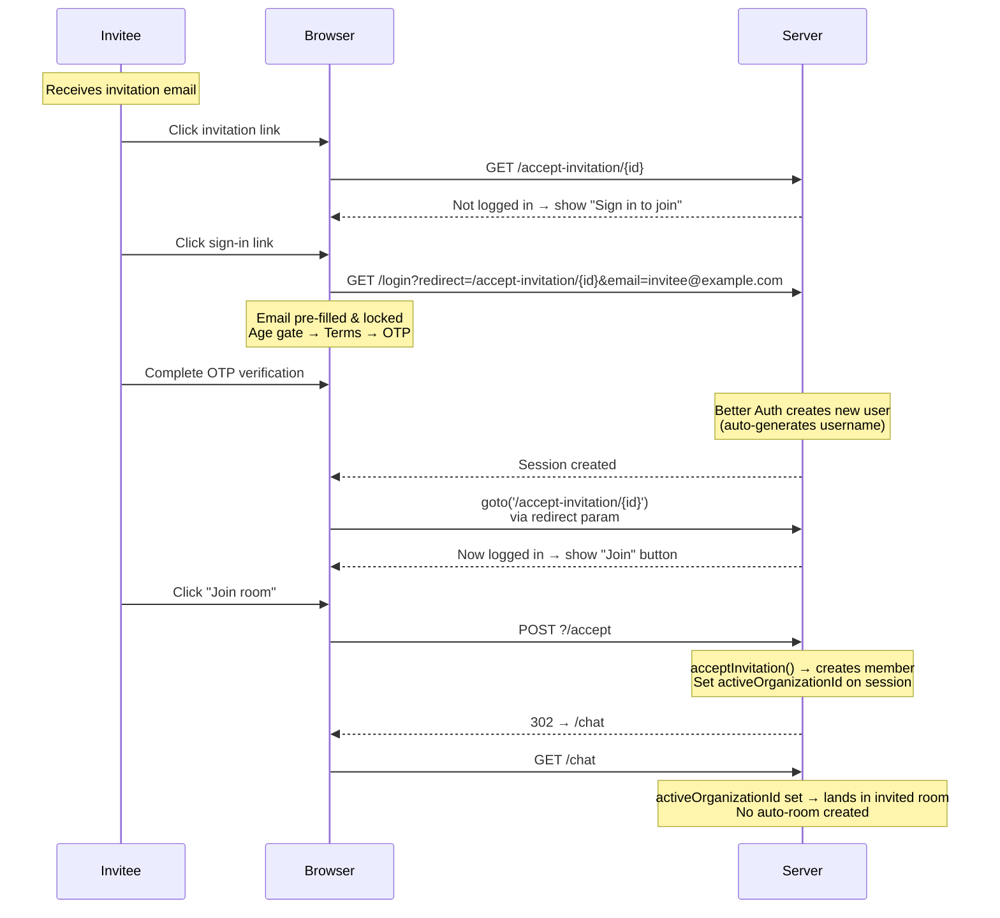

Source: `src/routes/accept-invitation/[id]/+page.server.ts`, `+page.svelte`

---

## 4. Room Resolution

When `/chat` loads, the server resolves which room to show. This is a cascade with multiple fallback paths.

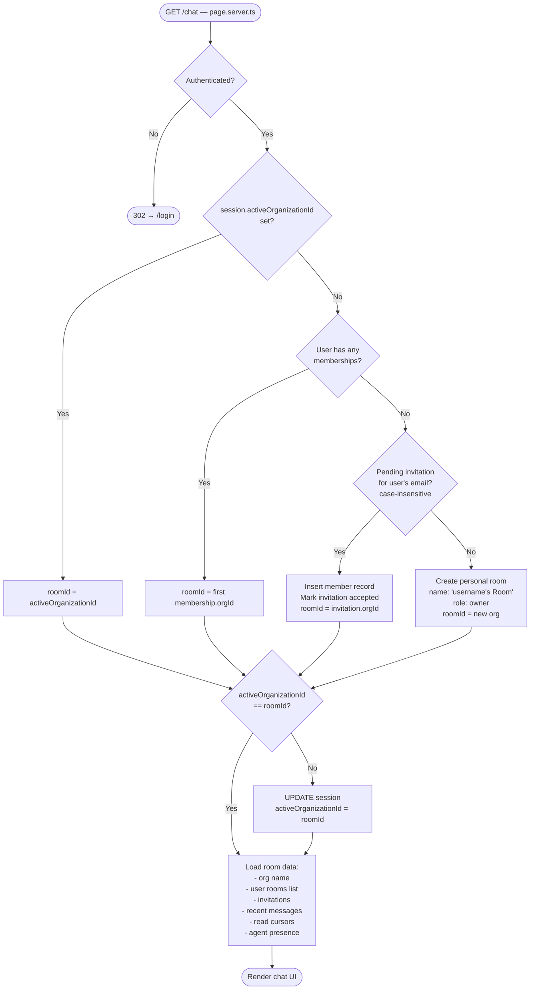

### Room Resolution Priority

| Priority | Condition | Result |
|----------|-----------|--------|
| 1 | `activeOrganizationId` set on session | Use that room |
| 2 | User has any memberships | Use first membership |
| 3 | Pending invitation matches email (case-insensitive) | Auto-accept and join that room |
| 4 | None of the above | Auto-create personal room |

Source: `src/routes/chat/+page.server.ts`

---

## 5. Session Management

### Per-Request Session Loading

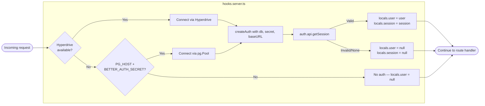

### Session Configuration

```typescript
// src/lib/server/auth/index.ts
session: {
  expiresIn: 60 * 60 * 24 * 7,    // 7-day absolute expiration
  updateAge: 60 * 60 * 24,         // Refresh token every 24 hours
  cookieCache: {
    enabled: true,
    maxAge: 60 * 5                  // 5-minute client-side cache
  }
}
```

### Session Lifecycle

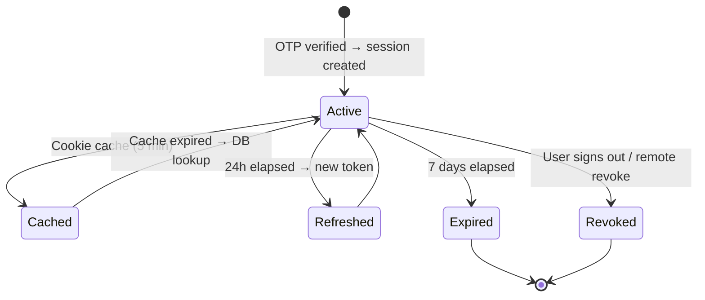

### Cookies

- `martol.session_token` — HTTP-only, session token (secure in production)
- Cookie prefix: `martol` (set via `advanced.cookiePrefix`)
- Secure cookies: enabled when `baseURL` starts with `https`

### Session Listing & Revocation

`GET /api/account/sessions` — list all active sessions for current user.
`DELETE /api/account/sessions` — revoke a specific session by ID (cannot revoke current session).

Source: `src/routes/api/account/sessions/+server.ts`

### Sign Out

Client calls `signOut()` from `$lib/auth-client`. Better Auth clears cookies and invalidates session.

---

## 6. API Key Authentication (Agents)

### Agent Creation

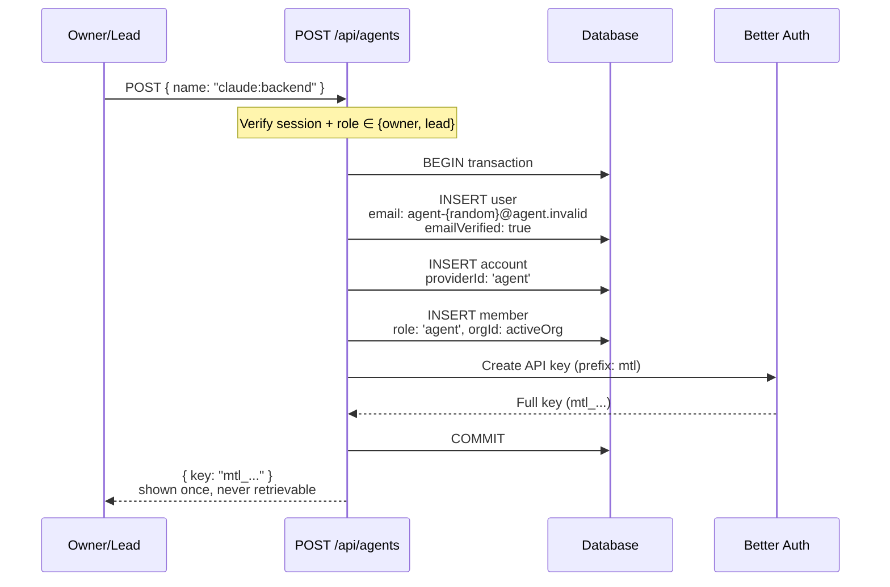

### Agent Authentication (WebSocket)

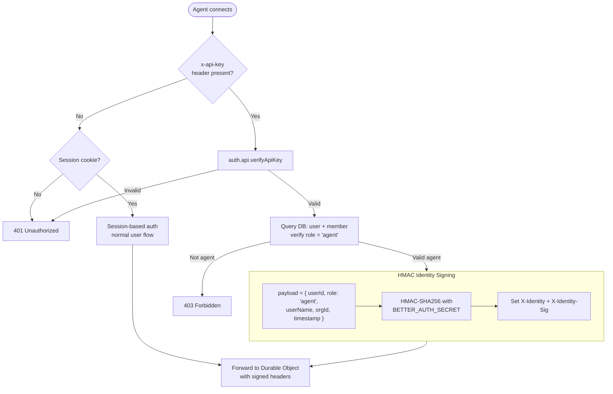

### Agent Authentication (MCP)

`src/lib/server/mcp/auth.ts`:

1. Extract `x-api-key` header
2. Verify via Better Auth API Key plugin
3. Optional KV revocation check (`revoked:{keyId}`)
4. Query DB for agent membership
5. Return `AgentContext { agentUserId, agentName, orgId, orgRole }`

---

## 7. Rate Limiting & Abuse Prevention

### Defense Layers

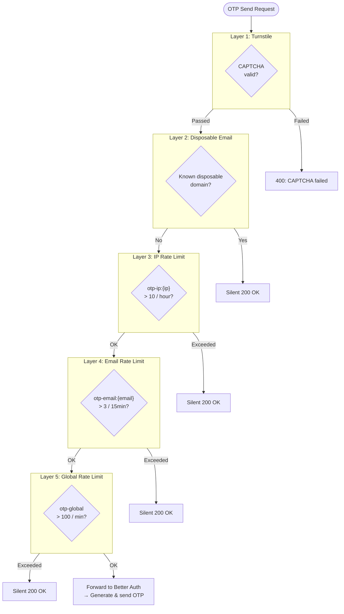

### OTP Send Rate Limits

Applied in `hooks.server.ts` before Better Auth processes the request:

| Limit | Key | Max | Window | Response |
|-------|-----|-----|--------|----------|
| Per-IP | `otp-ip:{ip}` | 10 | 1 hour | Silent 200 OK |
| Per-email | `otp-email:{email}` | 3 | 15 min | Silent 200 OK |
| Global | `otp-global` | 100 | 1 min | Silent 200 OK |

All blocked requests return `200 OK` to prevent enumeration.

### OTP Verify Rate Limits

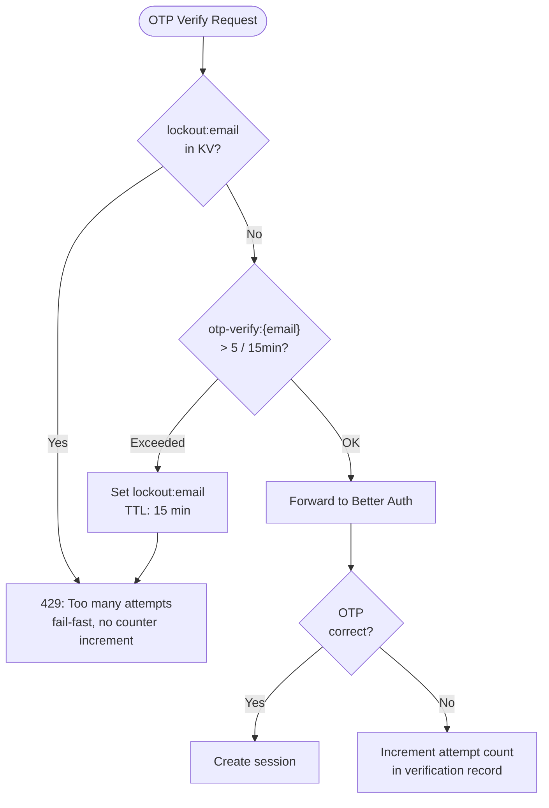

| Limit | Key | Max | Window | Response |
|-------|-----|-----|--------|----------|
| Per-email | `otp-verify:{email}` | 5 | 15 min | 429 + error message |
| Lockout | `lockout:{email}` | — | 15 min TTL | 429 "Too many attempts" |

### Disposable Email Blocking

`src/lib/server/disposable-emails.ts`: 35+ known disposable domains. Silent drop (200 OK).

### Rate Limiter Implementation

`src/lib/server/rate-limit.ts`: Sliding window counter in Cloudflare KV.

```
Key:   rl:{config.key}
Value: { count: number, windowStart: number }
TTL:   windowSeconds
```

Fail-open on KV errors (logs but doesn't block).

---

## 8. Terms Re-acceptance

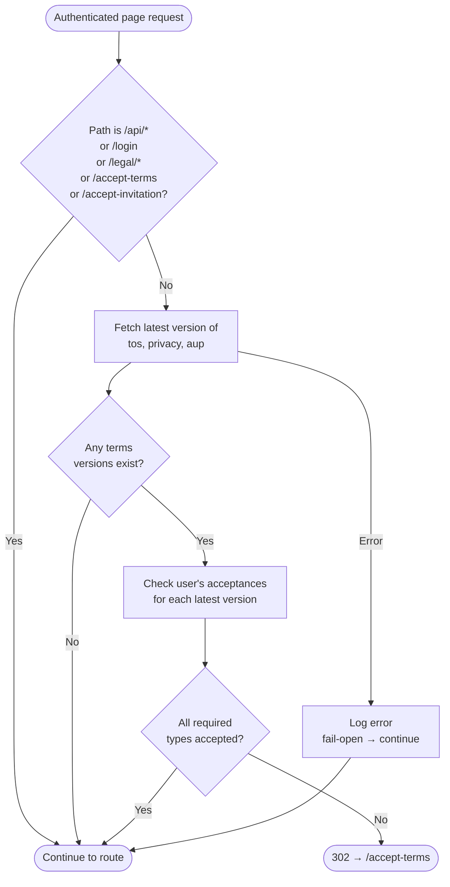

`hooks.server.ts:128-192` — runs on every authenticated page request.

1. Fetch latest version of each required type: `tos`, `privacy`, `aup`
2. Check if user has accepted each latest version in `termsAcceptances`
3. If any acceptance missing → `302` redirect to `/accept-terms`
4. Fail-open on errors (don't block user if check fails)

---

## 9. Security Audit & Known Issues

### Known Issues & Root Causes

#### twoFactorEnabled Column (Fixed 2026-03-02)

**Symptom**: New user sign-up via OTP fails with 500 error.

**Root cause**: The `twoFactor` plugin adds `twoFactorEnabled: boolean` to the user model. When Better Auth creates a new user, it includes `twoFactorEnabled: false` in the INSERT. If the Drizzle schema doesn't define this column, the adapter throws:

```
BetterAuthError: The field "twoFactorEnabled" does not exist in the "user" Drizzle schema
```

**Fix**: Added `twoFactorEnabled: boolean('twoFactorEnabled').default(false)` to user table in `auth-schema.ts` and ran `ALTER TABLE "user" ADD COLUMN IF NOT EXISTS "twoFactorEnabled" BOOLEAN DEFAULT FALSE` on production.

**Prevention**: After adding any Better Auth plugin, run `npx @better-auth/cli generate` to check for required schema changes.

#### Turnstile Site Key Missing from Vars (Fixed 2026-03-03)

**Symptom**: OTP send returns 400 "CAPTCHA verification required" on production.

**Root cause**: `TURNSTILE_SITE_KEY` was stored only as a Cloudflare secret (encrypted, server-only). The login page SSR couldn't access it, so the Turnstile widget never rendered. No `x-captcha-response` header was sent.

**Fix**: Added `TURNSTILE_SITE_KEY` to `wrangler.toml` `[vars]` (public vars accessible during SSR). Kept `TURNSTILE_SECRET_KEY` as a Cloudflare secret.

#### Invited User Lands in Wrong Room (Fixed 2026-03-03)

**Symptom**: User accepts invitation but lands in auto-created personal room instead of invited room.

**Root cause**: The `accept` action called `acceptInvitation()` (which creates the member record) but did not set `activeOrganizationId` on the session. When redirected to `/chat`, room resolution fell through to the first membership or auto-created room.

**Fix**: After `acceptInvitation()`, query the invitation's `organizationId` and update `session.activeOrganizationId` before redirecting. Applied to all three redirect paths in `accept-invitation/[id]/+page.server.ts`.

#### Hyperdrive SELECT Caching

**Observation**: INSERT via Hyperdrive succeeds (RETURNING returns data, record confirmed via direct psql), but SELECT in the same request returns 0 rows.

**Impact**: None for auth flows — OTP SEND and VERIFY are always separate HTTP requests, so the verification record is visible by the time VERIFY runs.

### Design vs Implementation Gaps

| 003-Auth.md Design | Current Implementation | Status |
|---|---|---|
| 2FA mandatory for room owners | Owners without 2FA redirected to settings (`5fe412d`) | **Fixed** 2026-03-03 |
| Passkey plugin | Not yet added (pending plugin availability) | **Gap** — P1 |
| 72-hour email undo | Email change flow not implemented | **Gap** — P1 |
| Lost-email recovery | Not implemented | **Gap** — P2 |
| Account audit logging | Login events logged via hooks (`295ea35`) | **Fixed** 2026-03-03 |
| Username history table | Schema exists, not populated on change | **Gap** — P2 |
| Invitation purge (7 days) | Cron purges expired invitations (`b5340b2`) | **Fixed** 2026-03-03 |
| Session cleanup cron | Cron trigger configured but cleanup logic TBD | **Gap** — P2 |
| Age gate stores `ageVerifiedAt` | Server-side age verification endpoint (`3599a84`) | **Fixed** 2026-03-03 |

### Identified Security Considerations

> **All items below were fixed on 2026-03-03.** See `docs/plans/2026-03-03-security-remediation.md` for details.

#### Critical — Fixed

| Item | Fix | Commit |
|------|-----|--------|
| Invitation decline has no auth check | Added email ownership verification before decline | `5b1909c` |
| Magic link GET leaks email in URL | Removed email from redirect URL | `1e299db` |

#### High — Fixed

| Item | Fix | Commit |
|------|-----|--------|
| Resend OTP bypasses Turnstile | Require Turnstile token for OTP resend, re-render widget | `8e5b998` |
| Report endpoint no membership check | Verify membership before accepting report | `082040c` |
| Inviter email leaked in template | Fall back to "A Martol user" instead of email | `1ef7c98` |
| Dev fallback exposes raw OTP | Block raw OTP in URL for production without KV | `688ffc5` |

#### Medium — Fixed

| Item | Fix | Commit |
|------|-----|--------|
| Chat auto-accept bypasses Better Auth | Use `acceptInvitation` API instead of raw INSERT | `ddab0ef` |
| Magic link POST no rate limit | Add IP-based rate limit (10/15min) to POST | `d3b82b5` |
| Agent auth non-deterministic room | Add `orderBy(createdAt)` for deterministic binding | `b977098` |
| `/whois` exposes user IDs | Restrict to owner/lead, remove user ID from response | `2e9567c` |
| No invitation rate limit | Add per-user rate limit (20/hr) for invitations | `08a82f1` |

#### Low — Fixed

| Item | Fix | Commit |
|------|-----|--------|
| Invitation list visible to all | Filter: owners see all, others see own invitations | `6e29197` |
| Missing reserved usernames | Expanded reserved words list (+14 entries) | `fec9486` |
| Age gate client-side only | Server-side age verification endpoint | `3599a84` |
| Upload trusts client content-type | Magic byte validation for JPEG/PNG/GIF/WebP/PDF | `60eecf1` |
| Room auto-creation race | Advisory lock prevents duplicate rooms | `2bf119d` |

---

## 10. Environment Variables

| Variable | Required | Purpose |
|----------|----------|---------|
| `BETTER_AUTH_SECRET` | Yes | Session encryption + HMAC signing (min 32 chars) |
| `RESEND_API_KEY` | Production | Email delivery via Resend |
| `EMAIL_FROM` | No | Sender address (default: `noreply@martol.app`) |
| `EMAIL_NAME` | No | Sender name (default: `Martol`) |
| `APP_BASE_URL` | No | Base URL for callbacks (default: `http://localhost:5190`) |
| `TURNSTILE_SITE_KEY` | Production | Cloudflare Turnstile public key (in wrangler.toml `[vars]`) |
| `TURNSTILE_SECRET_KEY` | Production | Cloudflare Turnstile secret (Cloudflare secret) |
| `CACHE` | Production | Cloudflare KV binding (rate limits, magic tokens, sessions) |
| `HYPERDRIVE` | Production | Cloudflare Hyperdrive binding (PostgreSQL) |
| `PG_HOST` | Local dev | Direct PostgreSQL host |

---

## 11. File Reference

| File | Responsibility |
|------|----------------|
| `src/hooks.server.ts` | Per-request auth, rate limiting, Turnstile, CORS, terms check |
| `src/lib/server/auth/index.ts` | Better Auth config: plugins, hooks, session, email callbacks |
| `src/lib/auth-client.ts` | Client-side auth: `signIn`, `signOut`, `emailOtp`, `organization` |
| `src/lib/server/db/auth-schema.ts` | Drizzle schema for all auth tables |
| `src/lib/server/email.ts` | Email sending (Resend) + OTP/invitation templates |
| `src/lib/server/rate-limit.ts` | KV sliding window rate limiter |
| `src/lib/server/disposable-emails.ts` | Disposable email domain denylist |
| `src/lib/server/mcp/auth.ts` | MCP agent authentication helper |
| `src/routes/login/+page.svelte` | Login UI: age gate, email, OTP, magic link |
| `src/routes/login/+page.server.ts` | Load Turnstile site key |
| `src/routes/api/auth/[...auth]/+server.ts` | Better Auth catch-all handler |
| `src/routes/api/auth/magic/+server.ts` | Magic link GET (redirect) + POST (verify) |
| `src/routes/accept-invitation/[id]/` | Invitation acceptance page + server logic |
| `src/routes/chat/+page.server.ts` | Room resolution, auto-creation, data loading |
| `src/routes/api/agents/+server.ts` | Agent CRUD + API key generation |
| `src/routes/api/account/sessions/+server.ts` | Session listing + revocation |
| `src/routes/api/rooms/[roomId]/ws/+server.ts` | WebSocket upgrade with session/API key auth |
| `src/routes/accept-terms/` | Terms re-acceptance page |
| `src/routes/api/terms/+server.ts` | Terms acceptance recording |
